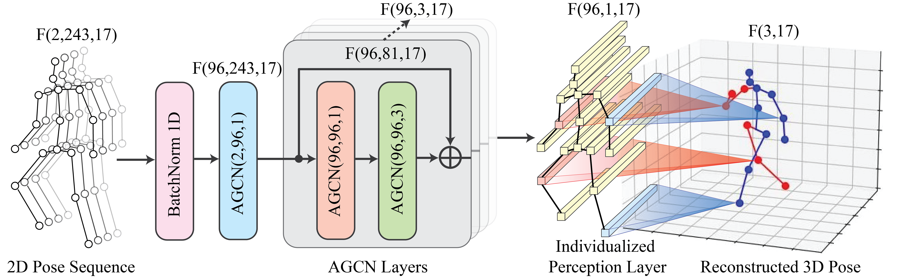
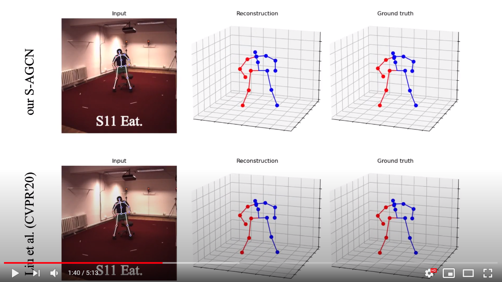

# Strided Adaptive Graph Convolutional Network (S-AGCN)
This repository holds the codebase, dataset and models for the work "**S-AGCN: Strided Adaptive Graph Convolutional Network for 3D Human Pose Estimation from Monocular Video**".

## Introduction
In this work, we propose a novel learning architecture called Strided Adaptive Graph Convolutional Network (S-AGCN) that utilizes graph convolutions to estimate the 3D human pose from a monocular video. We explicitly disentangle the structural features in the graph representation and leverage them to the 3D human pose estimation. Our S-AGCN is based on three key model designs that contribute to the performance. First, we adopt the Adaptive Graph Convolutional Network (AGCN) to effectively represent the 2D human pose. Second, we expand the AGCN representation with a strided design, which temporally shrinks the representation size for the 3D pose reconstruction. Third, we propose individually connected layers to reconstruct the 3D human pose from the shrunken AGCN representation. The architecture is straightforward to implement and uses a far smaller number of model parameters than state-of-the-art methods. We conduct extensive experiments on two benchmark datasets: Human3.6M and HumanEva-I to validate our model design. Experimental results show that our S-AGCN implemented with ground-truth 2D poses significantly outperforms state-of-the-art methods (e.g., up to 16% error reduction for the Human3.6M dataset). We also provide qualitative analysis to show the better performance achieved by our method.

<div align="center">
    
</div>

## Visualization and Comparison with SOTA
<div align="center">
      <a href="https://youtu.be/eI-8FEiTLdA?t=96s">
     
      </a>
    </div>

### Environment

The code is developed and tested on the following environment

* Python 3.8
* PyTorch 1.8 or higher
* CUDA 11

### Dataset

The source code is for training/evaluating on the [Human3.6M](http://vision.imar.ro/human3.6m) dataset. Our code is compatible with the dataset setup introduced by [Martinez et al.](https://github.com/una-dinosauria/3d-pose-baseline) and [Pavllo et al.](https://github.com/facebookresearch/VideoPose3D). Please refer to [VideoPose3D](https://github.com/facebookresearch/VideoPose3D) to set up the Human3.6M dataset (`./data` directory). We upload the training 2D cpn data [here](https://drive.google.com/file/d/131EnG8L0-A9DNy9bfsqCSrG1n5GnzwkO/view?usp=sharing) and the 3D gt data [here](https://drive.google.com/file/d/1nbscv_IlJ-sdug6GU2KWN4MYkPtYj4YX/view?usp=sharing).

#### Our updates
Some of the links above might not work, we provide the following for reproducing the results in our paper:
* Human3.6M: [CPN 2D](https://drive.google.com/file/d/1ayw5DI-CwD4XGtAu69bmbKVOteDFJhH5/view?usp=sharing), [Ground-truth 2D](https://drive.google.com/file/d/1U0Z85HBXutOXKMNOGks4I1ape8hZsAMl/view?usp=sharing), and [Ground-truth 3D](https://drive.google.com/file/d/13PgVNC-eDkEFoHDHooUGGmlVmOP-ri09/view?usp=sharing).
* HumanEva-I: [MRCNN 2D](https://drive.google.com/file/d/1IcO6NSp5O8mrjUTXadvfpvrKQRnhra88/view?usp=sharing), [Ground-truth 2D](https://drive.google.com/file/d/1UuW6iTdceNvhjEY2rFF9mzW93Fi1gMtz/view?usp=sharing), and [Ground-truth 3D](https://drive.google.com/file/d/1CtAJR_wTwfh4rEjQKKmABunkyQrvZ6tu/view?usp=sharing).
Above links are on Google Drive. You can also download all the above files via [BaiduYun](https://pan.baidu.com/s/1onNLKqrAbsc3mKRum5CAwA
code：1234).
Please put them in folder `./data` to reproduce the results.

### Evaluating pre-trained models
#### Human3.6M
We provide the pre-trained CPN model [here](https://drive.google.com/file/d/1dfmnDyhVC3l2zteigXepU2eXvmBnsBzM/view?usp=sharing) and ground truth model [here](https://drive.google.com/file/d/1Vu2c7fJFHP8v0GjBpJ2JTUPwGV3RlGRC/view?usp=sharing). To evaluate them, put them into the `./checkpoint` directory and run:

For cpn model:
```bash
python run_s-agcn.py -tta -k cpn_ft_h36m_dbb --evaluate cpn_s-agcn.bin
```

For ground truth model:
```bash
python run_s-agcn.py -tta --evaluate gt_s-agcn.bin
```

#### HumanEva-I
We provide the pre-trained MRCNN model [here](https://drive.google.com/file/d/1tRoDuygWSRWQsD9XuHCTHt13r0c5EZr6/view?usp=sharing) and ground truth model [here](https://drive.google.com/file/d/1IEqwcDtqQe70Vf3CilWARkrFE-gYRrkA/view?usp=sharing). To evaluate them, put them into the `./checkpoint` directory and run:

```bash
python run_s-agcn_HE_13.py -da -tta -d 'humaneva15' -k detectron_pt_coco -str 'Train/S1,Train/S2,Train/S3' -ste 'Validate/S1,Validate/S2,Validate/S3' -c 'checkpoint/humaneva' -a 'Walk,Jog,Box' -arc '3,3,3' -b 1024 --evaluate 96_detectron_pt_coco_27_supervised_epoch_990.bin --by-subject
```

```bash
python run_s-agcn.py -da -tta -d 'humaneva15' -str 'Train/S1,Train/S2,Train/S3' -ste 'Validate/S1,Validate/S2,Validate/S3' -c 'checkpoint/humaneva' -a 'Walk,Jog,Box' -arc '3,3,3' -b 1024 --evaluate 96_gt_27_supervised_epoch_819.bin --by-subject
```

### Training new models

To train a model from scratch, run:

```bash
python run_s-agcn.py -da -tta
```

`-da` controls the data augments during training and `-tta` is the testing data augmentation.

For example, to train our 243-frame ground truth model or CPN detections in our paper, please run:

```bash
python run_s-agcn.py -k gt -arc '3,3,3,3,3'
```

or

```bash
python run_s-agcn.py -k cpn_ft_h36m_dbb -arc '3,3,3,3,3'
```

It should require 48 hours to train on two GeForce RTX 3090 GPUs.

### Visualization and other functions

We keep our code consistent with [VideoPose3D](https://github.com/facebookresearch/VideoPose3D). Please refer to their project page for further information.

## Acknowledgements
This repo is based on
- [VideoPose3D](https://github.com/facebookresearch/VideoPose3D)
- [Attention3DHumanPose](https://github.com/lrxjason/Attention3DHumanPose)
- [2s-AGCN](https://github.com/lshiwjx/2s-AGCN)

Thanks to the original authors for their work!

## Contact
For any question, feel free to contact Bruce Yu: ```b r u c e x b y u AT gmail.com(remove space)```
