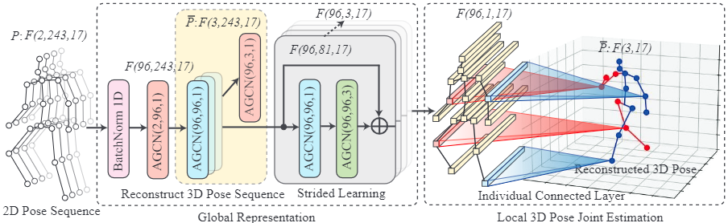

# GLA-GCN
[](https://paperswithcode.com/sota/3d-human-pose-estimation-on-mpi-inf-3dhp?p=gla-gcn-global-local-adaptive-graph)
[](https://paperswithcode.com/sota/3d-human-pose-estimation-on-human36m?p=gla-gcn-global-local-adaptive-graph)

This repository holds the codebase, dataset, and models for the work:
[**GLA-GCN: Global-local Adaptive Graph Convolutional Network for 3D Human Pose Estimation from Monocular Video**](http://arxiv.org/abs/2307.05853)

[Bruce X.B. Yu](https://bruceyo.github.io/)<sup>1</sup>,
[Zhang Zhi](https://github.com/tczhangzhi)<sup>1</sup>,
[Liu Yongxu](https://scholar.google.com.hk/citations?user=QQwy-dkAAAAJ&hl=en&oi=sra)<sup>1</sup>,
[Sheng-hua Zhong](https://sheng-hua-zhong.weebly.com/)<sup>2</sup>,
[Yan Liu](https://www4.comp.polyu.edu.hk/~csyliu/)<sup>1</sup>,
[Chang Wen Chen](https://chenlab.comp.polyu.edu.hk/)<sup>1</sup>

<sup>1</sup>The Hong Kong Polytechnic University, <sup>2</sup>Shen Zhen University.

<div align="center">
    
</div>

## Introduction
3D human pose estimation has been researched for decades with promising fruits. 3D human pose lifting is one of the promising research directions toward the task where both estimated pose and ground truth pose data are used for training. Existing pose lifting works mainly focus on improving the performance of estimated pose, but they usually underperform when testing on the ground truth pose data. We observe that the performance of the estimated pose can be easily improved by preparing good quality 2D pose, such as fine-tuning the 2D pose or using advanced 2D pose detectors. As such, we concentrate on improving the 3D human pose lifting via ground truth data for the future improvement of more quality estimated pose data.
Towards this goal, a simple yet effective model called Global-local Adaptive Graph Convolutional Network (GLA-GCN) is proposed in this work. Our GLA-GCN globally models the spatiotemporal structure via a graph representation and backtraces local joint features for 3D human pose estimation via individually connected layers.
We conduct extensive experiments on two benchmark datasets: Human3.6M and HumanEva-I, to validate our model design. Experimental results show that our GLA-GCN implemented with ground truth 2D poses significantly outperforms state-of-the-art methods (e.g., up to 3%, 17\%, and 13% error reductions on Human3.6M, HumanEva-I, and MPI-INF-3DHP, respectively). 

## Visualization and Comparison with SOTA
<div align="center">
      <a href="https://youtu.be/AGNFxQ5O8xM?t=23s">
     
      </a>
    </div>

### Environment

The code is developed and tested on the following environment

* Python 3.8
* PyTorch 1.8 or higher
* CUDA 11

### Dataset

The source code is for training/evaluating on the [Human3.6M](http://vision.imar.ro/human3.6m) dataset. Our code is compatible with the dataset setup introduced by [Martinez et al.](https://github.com/una-dinosauria/3d-pose-baseline) and [Pavllo et al.](https://github.com/facebookresearch/VideoPose3D). Please refer to [VideoPose3D](https://github.com/facebookresearch/VideoPose3D) to set up the Human3.6M dataset (`./data` directory). We upload the training 2D cpn data [here](https://drive.google.com/file/d/131EnG8L0-A9DNy9bfsqCSrG1n5GnzwkO/view?usp=sharing) and the 3D gt data [here](https://drive.google.com/file/d/1nbscv_IlJ-sdug6GU2KWN4MYkPtYj4YX/view?usp=sharing).

#### Our updates
Some of the links above might not work, we provide the following for reproducing the results in our paper:
* Human3.6M: [CPN 2D](https://drive.google.com/file/d/1ayw5DI-CwD4XGtAu69bmbKVOteDFJhH5/view?usp=sharing), [Ground-truth 2D](https://drive.google.com/file/d/1U0Z85HBXutOXKMNOGks4I1ape8hZsAMl/view?usp=sharing), and [Ground-truth 3D](https://drive.google.com/file/d/13PgVNC-eDkEFoHDHooUGGmlVmOP-ri09/view?usp=sharing).
* HumanEva-I: [MRCNN 2D](https://drive.google.com/file/d/1IcO6NSp5O8mrjUTXadvfpvrKQRnhra88/view?usp=sharing), [Ground-truth 2D](https://drive.google.com/file/d/1UuW6iTdceNvhjEY2rFF9mzW93Fi1gMtz/view?usp=sharing), and [Ground-truth 3D](https://drive.google.com/file/d/1CtAJR_wTwfh4rEjQKKmABunkyQrvZ6tu/view?usp=sharing).
Above links are on Google Drive. You can also download all the above files via [BaiduYun](https://pan.baidu.com/s/1onNLKqrAbsc3mKRum5CAwA
code：1234).
Please put them in folder `./data` to reproduce the results.

### Evaluating pre-trained models
#### Human3.6M
We provide the pre-trained models using CPN and GT 2D data, which can be found in the `./checkpoint` directory. To evaluate, pleasae run:

For cpn model:
```bash
python run_s-agcn.py -tta -k cpn_ft_h36m_dbb --evaluate 96_cpn_ft_h36m_dbb_243_supervised.bin
```

For ground truth model:
```bash
python run_s-agcn.py -tta --evaluate 96_gt_243_supervised.bin
```

#### HumanEva-I
We provide the pre-trained MRCNN model [here](https://drive.google.com/file/d/1tRoDuygWSRWQsD9XuHCTHt13r0c5EZr6/view?usp=sharing) and ground truth model [here](https://drive.google.com/file/d/1IEqwcDtqQe70Vf3CilWARkrFE-gYRrkA/view?usp=sharing). To evaluate them, put them into the `./checkpoint` directory and run:

```bash
python run_s-agcn_HE_13.py -da -tta -d 'humaneva15' -k detectron_pt_coco -str 'Train/S1,Train/S2,Train/S3' -ste 'Validate/S1,Validate/S2,Validate/S3' -c 'checkpoint/humaneva' -a 'Walk,Jog,Box' -arc '3,3,3' -b 1024 --evaluate 96_detectron_pt_coco_27_supervised_epoch_990.bin --by-subject
```

```bash
python run_s-agcn.py -da -tta -d 'humaneva15' -str 'Train/S1,Train/S2,Train/S3' -ste 'Validate/S1,Validate/S2,Validate/S3' -c 'checkpoint/humaneva' -a 'Walk,Jog,Box' -arc '3,3,3' -b 1024 --evaluate 96_gt_27_supervised_epoch_819.bin --by-subject
```

#### MPI-INF-3DHP
We follow the experimental setup in [p-stmo](https://github.com/patrick-swk/p-stmo). To evaluate them, put the checkpioint at [Google Drive](https://drive.google.com/drive/folders/1RFkIpRNR-78hu3lXF_yTxoiM6GVO0Jx9?usp=sharing) into the `./checkpoint` directory and run:

```bash
CUDA_VISIBLE_DEVICES=0,1,2,3,4,5,6,7 python -m torch.distributed.launch --nproc_per_node=8 --master_port=22241     main_sagcn_gpus_individual_fc_3dhp.py  --dataset '3dhp' --root_path data/s-agcn/  --batch_size 1200   --frames 81  --channel 256  --evaluate
```

### Training new models

To train a model from scratch, run:

```bash
python run_s-agcn.py -da -tta
```

`-da` controls the data augments during training and `-tta` is the testing data augmentation.

For example, to train our 243-frame ground truth model or CPN detections in our paper, please run:

```bash
python run_s-agcn.py -k gt -arc '3,3,3,3,3'
```

or

```bash
python run_s-agcn.py -k cpn_ft_h36m_dbb -arc '3,3,3,3,3'
```

It should require 48 hours to train on two GeForce RTX 3090 GPUs.

### Visualization and other functions

We keep our code consistent with [VideoPose3D](https://github.com/facebookresearch/VideoPose3D). Please refer to their project page for further information.

## Acknowledgements
This repo is based on
- [VideoPose3D](https://github.com/facebookresearch/VideoPose3D)
- [Attention3DHumanPose](https://github.com/lrxjason/Attention3DHumanPose)
- [2s-AGCN](https://github.com/lshiwjx/2s-AGCN)
- [p-stmo](https://github.com/patrick-swk/p-stmo)

Thanks to the original authors for their work!

## Citation
If you find this work is helpful, please cite our work:
```
@ARTICLE{yu2023glagcn,
  author={Yu, Bruce X.B. and Zhi, Zhang and Yongxu, Liu and Sheng-hua, Zhong and Yan, Liu and Chang Wen, Chen},
  journal={arXiv preprint arXiv:2307.05853},
  title={GLA-GCN: Global-local Adaptive Graph Convolutional Network for 3D Human Pose Estimation from Monocular Video}, 
  year={2023},
  volume={},
  number={},
  pages={1-1},
  }
```

## Contact
For any question, feel free to contact Bruce Yu: ```b r u c e x b y u AT gmail.com(remove space)```
